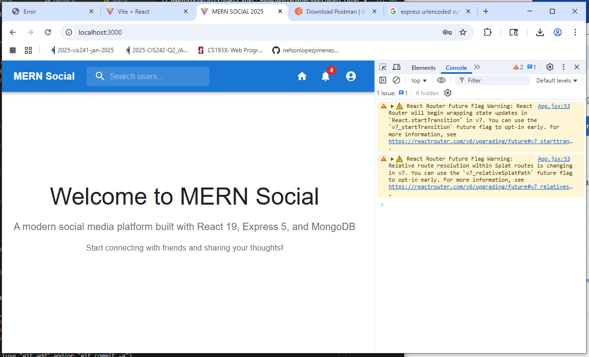

# two-mern-social-2025

## 8.2.2025
1.
## 8.1.2025

1. Original chapter five repository in folder mern-social-original-no-nodemodules
1. Folder structure copy/pasted from that location into the root of two-mern-social-2025
1. Claude used to refactor to latest versions

## MERN-Social Refactored for 2025 - Updated Technology Stack

This guide provides a complete refactoring of the MERN-Social application to use the latest versions of all technologies as of August 2025.

## 🚀 Updated Technology Stack

### Current Versions (August 2025)
- **Node.js**: v22.17.1 (LTS) - Current LTS until April 2027
- **React**: v19.1.1 - Latest stable with Server Components and Actions
- **Express**: v5.0.1 - Latest major version with async/await support
- **MongoDB**: v8.0+ - Latest with enhanced performance
- **Mongoose**: v8.17.0 - Current stable with full MongoDB 8.0 support
- **Material-UI**: v6.3.0 (@mui/material) - Current major version

## 📁 Updated Project Structure

```
mern-social/
├── client/                     # React 19 Frontend
│   ├── public/
│   │   ├── index.html
│   │   └── manifest.json
│   ├── src/
│   │   ├── components/         # React components
│   │   ├── hooks/             # Custom hooks
│   │   ├── pages/             # Page components
│   │   ├── utils/             # Utility functions
│   │   ├── services/          # API services
│   │   ├── context/           # React context
│   │   ├── App.jsx
│   │   └── index.js
│   ├── package.json
│   └── vite.config.js         # Using Vite instead of Create React App
├── server/                     # Express 5 Backend
│   ├── controllers/           # Route handlers
│   ├── models/               # Mongoose models
│   ├── routes/               # API routes
│   ├── middleware/           # Express middleware
│   ├── utils/                # Server utilities
│   ├── config/               # Configuration files
│   ├── app.js                # Express app setup
│   └── server.js             # Server entry point
├── shared/                    # Shared utilities
├── .env.example
├── .gitignore
├── docker-compose.yml         # Docker setup for development
├── package.json              # Root package.json
└── README.md
```
1. Interesting 
📁 Complete Client Component Structure:
🧭 Navigation & Routing:

Navbar.jsx - Complete navigation with search, notifications, and user menu
ProtectedRoute.jsx - Authentication guard for protected pages

🔐 Authentication Pages:

Login.jsx - Full login form with validation using Formik & Yup
Register.jsx - Registration form with password confirmation
Home.jsx - Main dashboard/feed page
Profile.jsx - User profile page

🗄️ State Management:

authStore.js - Zustand store for authentication state management

📂 Directory Structure to Create:
bashclient/src/
├── components/
│   ├── Navbar.jsx
│   └── ProtectedRoute.jsx
├── pages/
│   ├── Home.jsx
│   ├── Login.jsx
│   ├── Profile.jsx
│   └── Register.jsx
├── store/
│   └── authStore.js
├── hooks/
├── services/
├── utils/
├── App.jsx
└── index.js

## 4.12.2025

1. git@github.com:nelsonlopezjimenezchapter-five-mern-social.git

## 4.11.2025

## echo "# two-mern-social" >> README.md
1. git init
1. git add README.md
1. git commit -m "first commit"
1. git branch -M main
1. git remote add origin git@github.com:nelsonlopezjimenez/two-mern-social.git
1. git push -u origin main

## ssh-keygen for localepsilon at 0768
```sh
~/.ssh/config edit
/c/Users/Public/_AFTER-IMAGE/2025-APRIL/home-dot-ssh-config.txt
Host github.com
        User nelsonlopezjimenez
        IdentityFile ~/.ssh/id_ed25519
        
```

## two-mern-social
1. backend-mern-social
1. frontend-mern-social

## backend-mern-social
1. 6b8aa4b /api/v2 added to /routes/auth, post, user
1. e8ad1b3 3333 /api/users/ get route OK
1. This corresponds to an older version. I will have to find the newer version with /v2/routes added circumventing the authorization/validation

## frontend-mern-social
1. 6f053d6 giving up on router v6
1. 810adb8 Migrating from mui 4 to 5 and react-router-dom to 6
1. 73f7f24 Initialize project using create React App.
1. Also older version. I will refactor to delete router, mui, and use vite react install

## chapter05-from-gen2-laptop
This is the most current running version. I am not sure what nodejs is running. It appears to be 13. Originally was 8. This version contains almost all additional version2 routes. The branches are:
1. baseline-nodejs-13.12.0-npm-6.14.4
1. chapter05
1. chapter05-pending
1. main
1. 0a
as well as remote for all except 0a.
1. npm run development
1. npm start: NODE_ENV=production is not recognized
1. npm run serve: failed at server script
1. only npm run development works: compiles 95 hidden modules, then 378 hidden modules
1. Currently is running branch chapter-5-pending
1. Check if it runs with chapter05 branch.
1. The problems when using other than 13 version are related to ssl: I added a ssl-legacy configuration


#### Keep this version to run when testing astro rendering from 
1. ~/Documents/hoque-shama/tested-tower app


